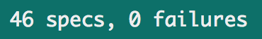

# Gilded Rose Tech Test

This is my solution in JavaScript to the Gilded Rose tech test. It's a simple app that allows the Gilded Rose shop to automatically up the quality of their stock, including for special items that have unique behaviour.

The full instructions for this can be found [here](https://github.com/emilybache/GildedRose-Refactoring-Kata).

*Tags: Jasmine, JavaScript, BDD, SOLID*

## The App


### Install

Clone this repo to your local machine.

### Test

This app doesn't require Node.js to test: I'm using a browser-based Jasmine library.

Open `SpecRunner.html` to run all Jasmine tests. For the current build all tests are passing.

<p></p>

### Use

To see the app working open `TexttestFixture.html`: it calculates the quality of each item over a number of days.


## Specification

I've translated the basic specification:

* Every day each item decreases the SellIn and Quality values by 1.
* When SellIn < 0, Quality decreases by 2.
* For normal items: 0 <= Quality <= 50
* Exceptions:
	1. Aged Brie: quality increases as SellIn decreases
	2. Sulfuras: quality and sellIn are static
	3. Backstage passes: quality increases as SellIn decreases 
		- 5 < SellIn <= 10: quality increase +2
		- 0 < SellIn <=5  : quality increase +3
		- SellIn <= 0    : quality = 0

The new specification:

* "Conjured" items degrade as fast as normal items.

## User Stories

Existing user stories:

```
As a shop owner
So I can keep track of my stock
I'd like a system to automatically update the quality and sellIn values of my inventory

As a shop owner
So my stock quality updates appropriately
I'd like all normal items to reduce in quality by 1 each day

As a shop owner
So I can get rid out of date stock more quickly
I'd like items with sellIn < 0 to degrade in quality by 2 each day

As a shop owner
So I never pay people to take my stock away
I'd like all items to have a minimum quality of 0

As a shop owner
So I provided good value to my customers
I'd like all normal items to have a maximum quality of 50

As a shop owner
So I can take advantage of certain items value
I'd like to define unique behaviours of quality vs sellIn

As a shop owner
So I can make the most profit from "Sulfuras"
I'd like its quality to remain static at 80

As a shop owner
So I can make the most profit from "Aged Brie"
I'd like its quality to increase by 1 each day

As a shop owner
So I can make the most profit from "Backstage passes"
I'd like its quality to increase as sellIn approaches zero
```

The new customer requirement translates into an extra user story:

```
As a shop owner
To take advantage of "conjured" items short shelf life
I'd like the quality to decrease twice as quickly as normal items
```

To cover a potential error case:

```
As a shop owner
To cover any typos I make
I'd like the update system to be cases insensitive
```


## Domain Model

```                                
╔════════════╗     
║            ║  Controls the update of quality     
║    Shop    ║  Returns updated array of Items
║            ║      
╚════════════╝  
    |     |
    |     |  
    |     |  
    |     |                        ╔════════════╗
    |     |                        ║            ║      
    |     |------------------------║   Update   ║  Modifies state
    |                              ║            ║ 
    |                              ╚════════════╝ 
    |   
    |    
    | [ array of Items passed into Shop upon instantiation ]           
    |   
╔════════════╗  
║            ║ 
║    Item    ║  Stores state   
║            ║
╚════════════╝                                                 
```

## Process

My focus was to create clean, readable and easily modifiable code. To highlight my approach to solving this problem:

* Read and understand the specification and translate these into user stories.
* Create feature tests for the user stories (this helped me ensure I had translated the specification correctly).
* Create an idea of my domain model and how I wanted to split functionality between classes.
* Create unit tests for each of the classes and write code that satifies these unit tests (ensuring my feature tests still pass).
* Commit (regularly!) with a semantic message and add a comment if I feel it is necessary.
* Refactor and ensure my tests still pass.


## Areas of Improvement

I'd like to add prototype functions to the Item class. I felt like it should be the item's responsibility to know what type of item it is. Currently this logic is within the Shop class. However, out of respect for the specification, I have left the Item class untouched.
